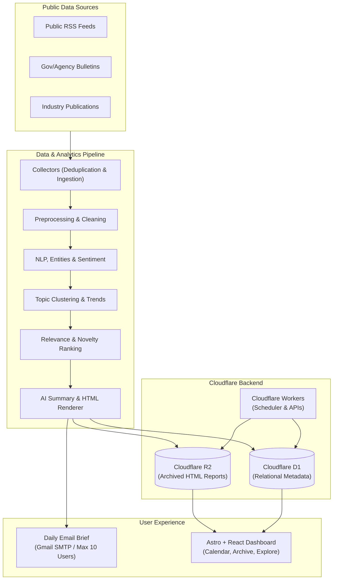

# SignalBrief

> **Know what changed. Understand why it matters. See what to watch next.**

[](LICENSE)
[](https://www.python.org/)
[]()

**SignalBrief** is an open-source, free-first, notebook-first text analytics and intelligence briefing platform. It continuously gathers updates from verified public sources, analyzes developments across configurable domains (starting with **Manufacturing**), produces responsive one-page daily intelligence reports, and delivers them directly to subscribers.

---

## Key Principles

- **Open Source & Free-First**: Operates within zero-cost allowances (Cloudflare Workers, D1, R2, Pages, local NLP/open inference) without mandatory paid third-party dependencies.
- **Notebook-First**: Every analytical algorithm—source collection, text cleaning, NER, topic clustering, and report rendering—is researched, validated, and documented across 11 sequential Jupyter notebooks before moving to production code.
- **Traceable Intelligence**: Every synthesized fact and key development links directly back to its original public source article.
- **Domain Independent**: Configured via declarative YAML definitions. Manufacturing is the primary initial domain, with out-of-the-box templates for Supply Chain, AI, and Finance.

---

## System Architecture



---

## Project Structure

```
SignalBrief/
├── .antigravity/            # AI agent development rules & operational workflows
├── .github/                 # CI/CD workflows, issue templates, PR conventions
├── notebooks/               # Research notebooks 00 to 10 (Pipeline Reference)
├── src/signalbrief/         # Modular Python analytics package
│   ├── config/              # Declarative config loaders & Pydantic schemas
│   ├── collectors/          # Resilient RSS/Web scrapers with deduplication
│   ├── preprocessing/       # HTML cleaning, language detection & normalization
│   ├── analytics/           # TF-IDF, embeddings, sentiment & entity extraction
│   ├── ranking/             # Multi-factor relevance & novelty scoring
│   ├── reporting/           # Report validation, synthesis & Jinja2 renderers
│   └── pipeline/            # End-to-end daily runner & state machine
├── web/                     # Astro + React dashboard application
├── workers/                 # Cloudflare Workers (scheduler, API, email queue)
├── templates/               # Responsive HTML report & email templates
├── configs/                 # Declarative domain & source definitions (YAML)
├── data/                    # Local raw, interim, processed, & sample datasets
├── reports/                 # Locally generated reports & previews
├── tests/                   # Pytest test suites (unit, integration, evaluation)
├── migrations/              # Cloudflare D1 SQL schema migrations
├── scripts/                 # Utility & environment validation scripts
└── docs/                    # Architecture, methodology, & data dictionaries
```

---

## Quickstart (Development Setup)

### 1. Prerequisites
- Python 3.11 or 3.12
- Git
- `uv` (recommended) or standard `pip`

### 2. Environment Setup
```bash
# Clone the repository
git clone https://github.com/yourusername/SignalBrief.git
cd SignalBrief

# Create virtual environment
uv venv .venv
# On Windows:
.venv\Scripts\activate
# On Linux/macOS:
# source .venv/bin/activate

# Install dependencies in editable mode
uv pip install -e ".[dev]"
```

### 3. Launch Research Notebooks
```bash
jupyter lab
```
Navigate to `notebooks/00_project_overview.ipynb` to begin.

### 4. Run Tests & Linting
```bash
pytest
ruff check .
```

---

## Development Roadmap

| Phase | Milestone | Focus | Gate / Acceptance |
| :--- | :--- | :--- | :--- |
| **Phase 0** | **Foundation** | Repository structure, Antigravity rules, Python environment | Repo initializes and tests pass |
| **Phase 1** | **Research** | 11 Jupyter notebooks (00–10) | Verified HTML report from real feeds |
| **Phase 2** | **Python Package** | Modularize `src/signalbrief/`, pipeline CLI | Tested runner operates standalone |
| **Phase 3** | **Cloudflare Backend** | D1 database, R2 archiving, Cron Workers | Headless daily report archive verified |
| **Phase 4** | **Delivery & UI** | Email delivery & Astro/React web dashboard | Invited subscribers access daily briefs |
| **Phase 5** | **Production QA** | CI/CD automation, monitoring, failure recovery | Seamless daily cycle for 10 subscribers |

---

## License

This project is licensed under the [MIT License](LICENSE).
