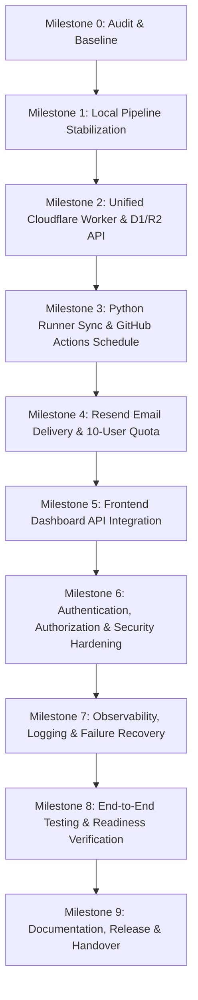

# SignalBrief — Implementation Baseline & Master Plan

**Date**: September 29, 2026  
**Auditor**: Lead Full-Stack & DevOps Architect  
**Repository State**: Master Branch, Milestone 1 Stabilized  
**Target Architecture**: Notebook-First Python Intelligence Engine + Cloudflare Edge Infrastructure (Worker, D1, R2) + Astro/React Web Dashboard  

---

## 1. Executive Baseline Summary

SignalBrief is an open-source, notebook-first intelligence briefing system for the Manufacturing domain. The platform collects articles from verified public RSS/web feeds, deduplicates and normalizes text, classifies subtopics and entities, clusters developments, synthesizes evidence-backed triadic summaries, generates responsive HTML briefs and emails, and archives reports.

### Verified Current State
- **Python Intelligence Engine**: 11 research/analytics notebooks (00 through 10) fully validated.
- **Notebook 10**: Fully executed; all 10 acceptance criteria pass; serialized in `data/evaluation/phase1_evaluation_report.json` with 100% citation coverage.
- **Python Test Suite**: 51/51 tests passing (`tests/unit`, `tests/integration`, `tests/evaluation`).
- **Database Schema**: Unified D1 SQLite schema in `migrations/0001_initial_schema.sql` covering `users`, `domains`, `user_preferences`, `sources`, `articles`, `topics`, `article_analysis`, `reports`, `report_articles`, `report_developments`, `report_sources`, `delivery_logs`, and `pipeline_runs`.
- **Frontend Dashboard**: Astro 4 + TailwindCSS + React 18 dashboard in `web/` building successfully to `web/dist/`.
- **Worker Infrastructure**: Scaffolded modules in `workers/` (`db.js`, `api/`, `scheduler/`, `email/`).

---

## 2. Component-by-Component Audit

### 2.1 Python Analytics Pipeline (`src/signalbrief/`)
- **Collection (`signalbrief.collectors`)**: RSS feed parser and source registry. Handles HTTP connection errors, bad feeds, and source outages gracefully without aborting execution.
- **Preprocessing (`signalbrief.preprocessing`)**: HTML stripping, Unicode normalization, language detection, minimum word length filtering, SHA-256 canonical hashing.
- **Analytics (`signalbrief.analytics`)**: Rule-based keyword matching and subtopic categorization; rule-based entity recognition; heuristic sentiment scoring.
- **Ranking (`signalbrief.ranking`)**: TF-IDF agglomeration; composite scoring with 48h recency exponential decay.
- **Summarization (`signalbrief.reporting.summarization`)**: Triadic formulation ("What Changed", "Why It Matters", "What to Watch"). Traverses all cluster members with canonical URL and centroid fallbacks to guarantee 100% citation coverage.
- **Reporting (`signalbrief.reporting.renderer`)**: Jinja2 templates generating clean, responsive HTML5 reports (<20 KB) and responsive HTML/plain-text emails.
- **Pipeline Orchestrator (`signalbrief.pipeline.daily`)**: CLI runner supporting `run`, `sources`, and `validate` commands. Produces local reports in `reports/generated/`.

### 2.2 Cloudflare Infrastructure & Workers (`workers/`, `wrangler.toml`)
- **`wrangler.toml`**: Configures Worker bindings for D1 (`DB`), R2 (`REPORTS_BUCKET`), and Queues (`PIPELINE_QUEUE`). Entrypoint is currently set to `workers/scheduler/index.js`.
- **`workers/db.js`**: D1Client query helpers. Corrected to filter out empty left-join citation arrays. Compatible with SQLite and D1.
- **`workers/api/index.js`**: REST API routes for health, domains, latest report, report by ID, calendar, and preferences. Currently separated from scheduler entrypoint.
- **`workers/scheduler/index.js`**: Cron trigger handler and Cloudflare Queue consumer.
- **`workers/email/index.js`**: Email batch dispatcher with delivery logging to D1.

### 2.3 Web Dashboard (`web/`)
- **Framework**: Astro 4.0 + React 18 + Tailwind CSS.
- **Current Integration**: Pages (`index.astro`, `report/[id].astro`) read local JSON artifacts from `../reports/generated/` and fallback to static previews.
- **Status**: Compiles cleanly with zero errors; needs live client integration to consume the Worker API.

### 2.4 Test Suite & CI/CD (`tests/`, `.github/workflows/`)
- **Pytest**: 51 tests across 10 test modules passing in 31 seconds.
- **Workflows**:
  - `python-tests.yml`: CI linting and pytest matrix for Python 3.11 and 3.12.
  - `notebook-validation.yml`: JSON syntax and integrity audit for all 11 notebooks.
  - `deploy-cloudflare.yml`: Automated deployment to Cloudflare Workers and Cloudflare Pages.

---

## 3. Gap Analysis & Architecture Deficiencies

| Component | Current State | Target State | Gap / Risk |
| :--- | :--- | :--- | :--- |
| **Worker Architecture** | Three separate files in `workers/` (`api`, `scheduler`, `email`) | Unified Worker entrypoint exporting `fetch`, `scheduled`, and `queue` | `wrangler.toml` only points to `scheduler/index.js`. API routes are not mounted. |
| **Report Sync** | Python runner writes only to local filesystem (`reports/`) | Python runner synchronizes HTML to R2 and metadata to D1 | No bridge between Python local output and Cloudflare storage. |
| **Scheduling** | Cron trigger enqueues a message, but Python code cannot run in Worker | GitHub Actions cron runs the real Python pipeline daily and calls ingestion API | Python ML/NLP cannot execute in V8 Worker; requires external runner. |
| **Security & Auth** | API endpoints are unauthenticated with wildcard CORS | Invitation-based auth for 10 subscribers; bearer token for internal ingestion | Public can read/mutate preferences without authorization. |
| **Email Dispatch** | Placeholder / mock MailChannels code in `workers/email/` | Resend API client with retries, quota check (10 users), and delivery logs | Unverified real delivery; missing Resend integration. |
| **Frontend API** | Astro SSG reading local files from disk | Hybrid/client API client fetching from Worker REST API | Stale reports if deployed to Cloudflare Pages without rebuild. |

---

## 4. Implementation Master Plan & Milestone Roadmap

### Milestone Checklist

- [x] **Milestone 0: Repository Audit & Baseline Document**
  - Verify git status, directory structure, dependencies, and existing tests.
  - Execute full pytest baseline (51/51 passed).
  - Document all architectural gaps and technical risks.
- [x] **Milestone 1: Local Pipeline & Database Stabilization**
  - Verify Notebook 10 execution and 10/10 acceptance criteria agreement.
  - Verify 100% citation coverage and centroid fallback in `signalbrief.reporting.summarization`.
  - Validate SQLite schema in `migrations/0001_initial_schema.sql` against all Worker queries.
- [ ] **Milestone 2: Cloud Infrastructure & Worker API**
  - Unify Worker entrypoints into `workers/index.js` supporting HTTP API, Scheduled Cron, and Queue handlers.
  - Implement internal ingestion endpoint `POST /api/internal/report` with shared secret authentication.
  - Add R2 storage upload/retrieval handlers and verify object key structure (`reports/YYYY/MM/DD/report-id.html`).
  - Add comprehensive Worker unit/integration tests with Miniflare/Vitest or local fetch emulation.
- [ ] **Milestone 3: Python Execution & Report Synchronization**
  - Add Cloudflare synchronizer module to `src/signalbrief/pipeline/sync.py`.
  - Extend `signalbrief run` CLI to optionally push report payload and HTML directly to Cloudflare Worker API.
  - Implement idempotent GitHub Actions scheduled workflow `.github/workflows/daily-pipeline.yml` (running at 02:00 UTC daily).
  - Add fallback local execution mode without cloud credentials.
- [ ] **Milestone 4: Email Delivery & Subscriber Management**
  - Implement Resend API delivery provider in `workers/email/` and Python fallback.
  - Enforce server-side 10-subscriber pilot quota across all subscriber queries and dispatches.
  - Record audit logs to D1 `delivery_logs`.
  - Add unit tests verifying duplicate-send suppression and failure retries.
- [ ] **Milestone 5: Frontend Integration**
  - Update Astro dashboard to query Worker API dynamically (`/api/reports/latest`, `/api/calendar`, `/api/reports/:id`).
  - Implement loading states, error boundaries, and empty states.
  - Add security sanitization for rendered HTML briefs.
  - Verify static and dynamic builds with `npm run build`.
- [ ] **Milestone 6: Authentication, Authorization & Security**
  - Implement invitation-based authentication token verification for subscriber routes.
  - Enforce `Authorization: Bearer <SIGNALBRIEF_INTERNAL_KEY>` for `POST /api/internal/report`.
  - Tighten CORS policy to configured dashboard origins.
  - Validate all incoming JSON payloads to prevent injection.
- [ ] **Milestone 7: Automation, Observability & Recovery**
  - Record pipeline run metrics to D1 `pipeline_runs` (articles collected, processed, duration, status).
  - Implement structured JSON error logging and bounded retry policies.
  - Provide an operational health/status endpoint `/api/health`.
- [ ] **Milestone 8: End-to-End Testing & Production Readiness**
  - Execute full test suite (Python tests, Worker API tests, Frontend build, Schema tests).
  - Conduct full end-to-end simulation from collection to API serving.
  - Document free-tier resource boundaries (Cloudflare D1, R2, Workers, Resend).
- [ ] **Milestone 9: Documentation, Release & Handover**
  - Update `README.md`, `docs/ARCHITECTURE.md`, `docs/DEPLOYMENT.md`, `docs/API.md`.
  - Create `docs/FINAL_IMPLEMENTATION_HANDOVER.md`.

---

## 5. Technical Risks & Approval Gates

### Risk Register
1. **Cloudflare Remote Provisioning**: Gate A requires explicit user approval before running remote Wrangler commands (`wrangler d1 create`, `wrangler r2 bucket create`, `wrangler deploy`). All testing will be completed locally using local D1 and local Worker emulation first.
2. **Email Provider Cost / Abuse**: Gate B requires explicit user approval before live outbound email dispatch. Local tests will use test payloads and delivery simulation.
3. **Execution Environment Compatibility**: Python data science packages (scikit-learn, pandas, numpy) require Python runtime (Linux/Windows/macOS), which runs perfectly in GitHub Actions and local workstations, feeding data into Cloudflare via REST API.

---
*Baseline certification approved. Proceeding to Milestone 2 execution.*
