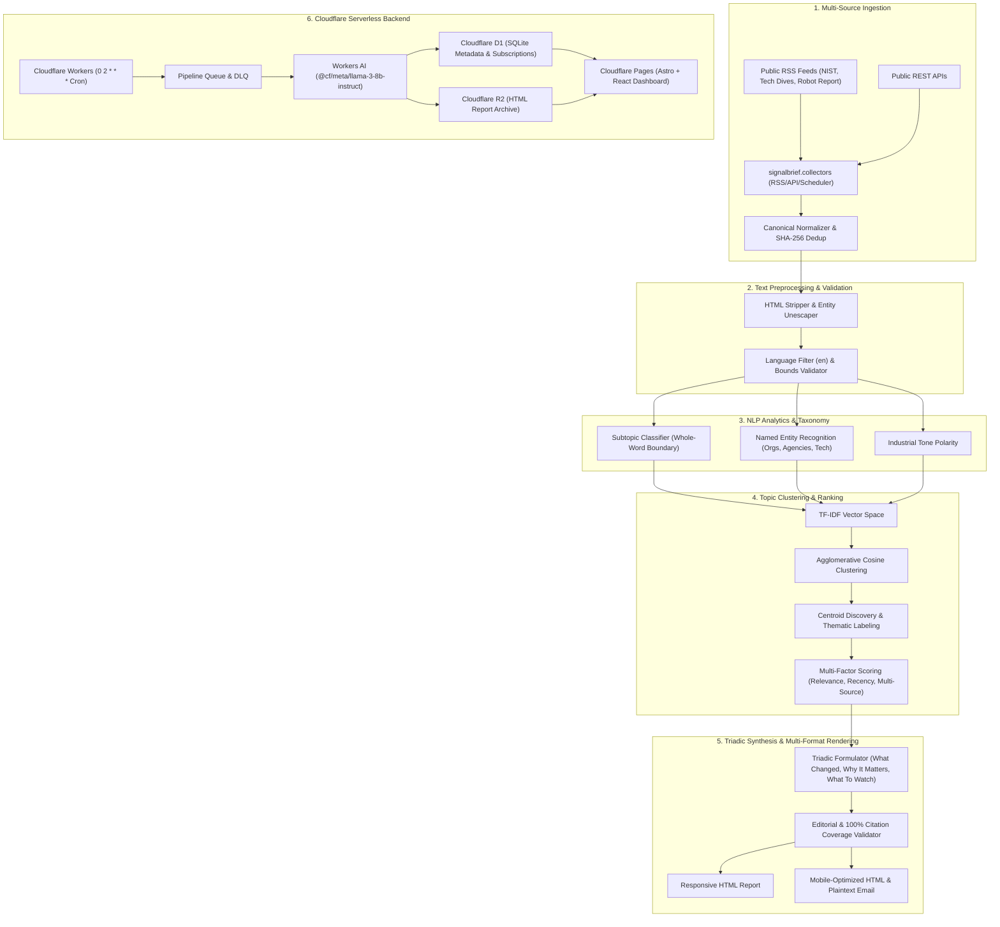

# SignalBrief System Architecture Overview

SignalBrief is an open-source, free-first, notebook-first AI text analytics and daily intelligence briefing platform.

## Core Architectural Blueprint

## Architectural Tenets

1. **Notebook-First Research**: All empirical methods and algorithms were researched, evaluated, and documented in notebooks `00` through `10` before migration to production modules.
2. **Zero-Paid Dependency**: The entire stack operates reliably within free tier limits (Cloudflare Workers, D1, R2, GitHub Actions, open-source models).
3. **100% Citation Coverage**: Every development reported in a briefing must link directly to verified public primary sources.
4. **Clean Decoupling**: Reusable Python analytical logic in `src/signalbrief/` executes standalone via CLI (`signalbrief run`) or within scheduled Cloudflare serverless environments.
